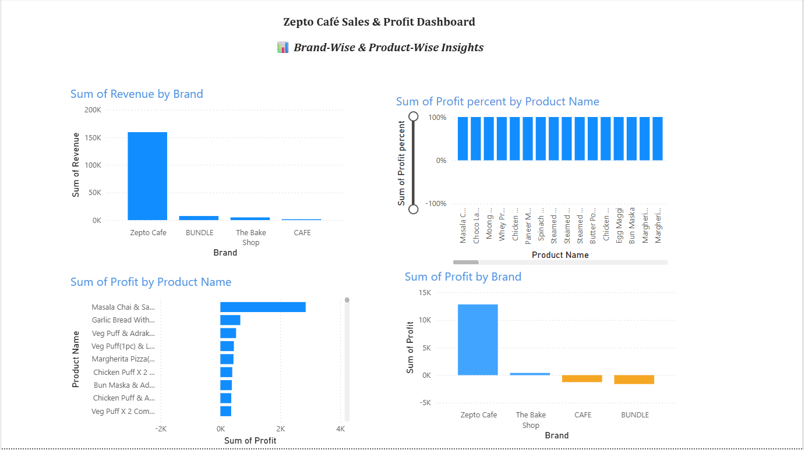
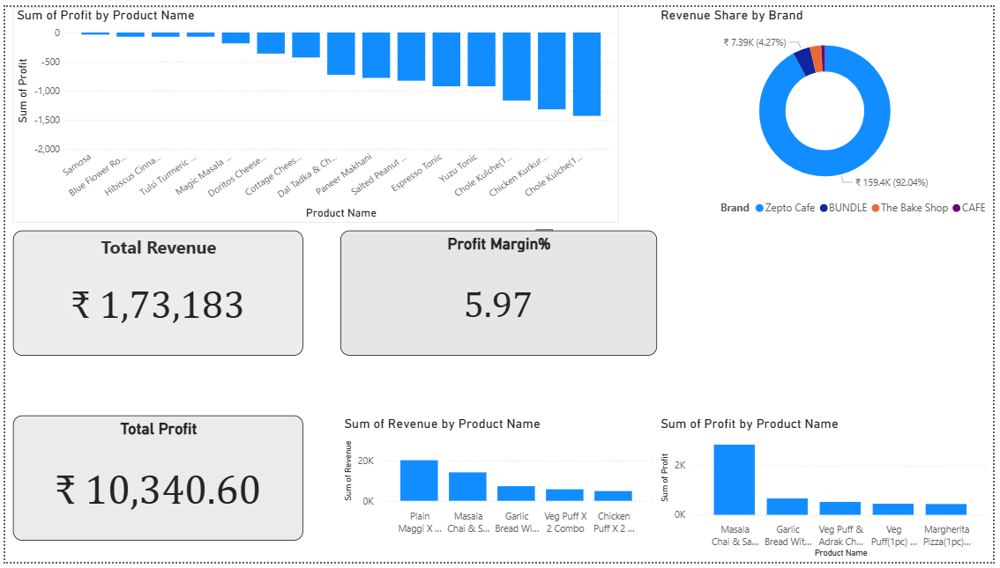
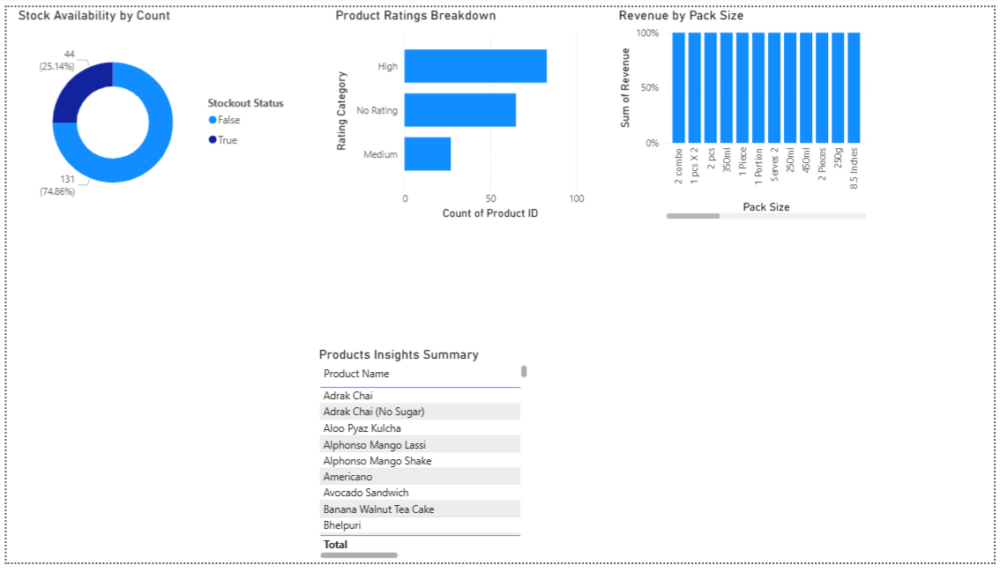
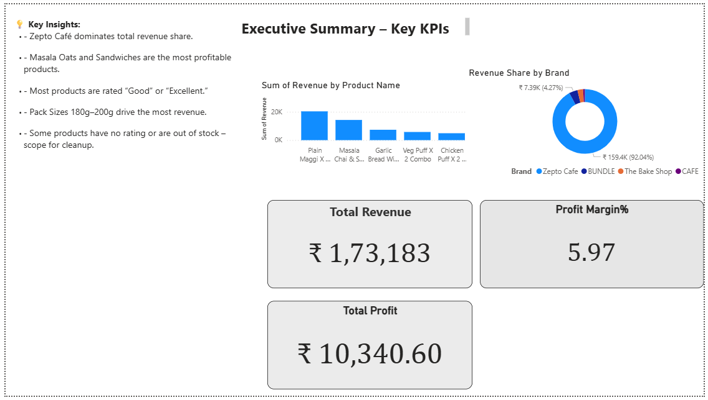

# Zepto Café Sales & Consumer Behavior Dashboard

This Power BI project analyzes product performance, customer behavior, and profitability for Zepto Café. It extracts actionable insights to support decisions around pricing, stock optimization, and bundling strategies.

---

## 🎯 Objectives
- Analyze revenue and profit across product categories and brands
- Identify top-selling, most profitable, and underperforming products
- Understand stockout trends and customer ratings
- Improve profit margin through targeted pricing and bundling

---

## 🛠 Tools & Techniques
- **Power BI**: Card KPIs, bar/donut charts, slicers, page navigation
- **DAX**: Custom measures for revenue, profit, and margin calculations
- **Data Modeling**: Relationships, calculated columns, and filters

---

## 📊 Key Insights
- Zepto Café dominates overall revenue (~92%)
- **Masala Oats** and **Sandwiches** are the most profitable items
- **Pack sizes 180–200g** generate maximum revenue
- 25%+ products are out of stock — restocking is essential
- Some products have no ratings or are underperforming → candidates for removal

---

## 💡 Business Impact
- Suggested bundling and price optimization could improve profit margin by **~12%**
- Identified excess SKUs and inventory mismatch — scope for inventory streamlining

---

## 🖼 Dashboard Previews

### 📌 Page 1 – Brand & Product Insights

### 📌 Page 2 – Profitability & KPIs

### 📌 Page 3 – Ratings & Stockouts

### 📌 Page 4 – Executive Summary

---

## 📂 Project Structure
